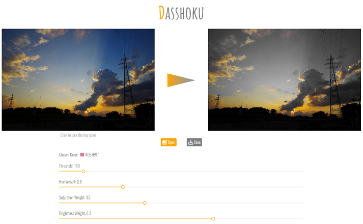
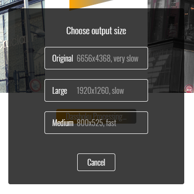

Dasshoku は指定した画像から、特定の色だけを残して白黒化するウェブアプリです。

## 使い方

画面の左側にはオリジナルの画像が、右側には「特定の色（キーカラーと呼びます）を除いて白黒化」（脱色と呼びます）された画像が表示されています。Open ボタンを押すことで、好きな画像を読み込むことができます。

オリジナル画像をクリックするとその位置の色がキーカラーとして選択され、右側の脱色された画像が更新されます。現在選択中のキーカラーは Chosen Color に表示されています。

キーカラーの選択だけで望んだ結果が得られない場合は、画面下部のスライダーを操作することで結果が変化します。

満足のいく結果が得られたら、Save ボタンを押すことで画像を保存できます。保存する際はサイズを選択するダイアログが表示されるので、お好みのサイズで保存してください。

このときに大きなサイズを選択すると計算量が増えるため、ダウンロードが始まるまでにかかる時間が長くなります（なんとなくの計算時間が参考に表示されています）。

### スライダーの調整

Dasshoku には、以下の4つのスライダーが用意されています。基本的にスライダーは左に行くほど「キーカラーと同じ色」の判定が緩くなり、脱色画像には多くの色が残されます。逆に右に行くほど判定は厳しくなり、脱色画像の殆どの部分は白黒になります。

* Threshold
* Hue Weight
* Saturation Weight
* Brightness Weight

これらを調整することで、理想の脱色に近づくことができるかもしれません。それぞれのスライダーの効果を解説します。

#### Threshold スライダー

このスライダーは、「キーカラーと同じ色」の判定全体のしきい値を調整します。この数字が大きくなる（左側へ行く）ほど、遠い色も「同じ色」として判定されます。小さくなる（右側へ行く）ほど、近い色でも「同じ色」とは判定されづらくなります。

#### Hue Weight スライダー

このスライダーは、「キーカラーと同じ色」の判定に色相が影響する量を調整します。この数字が小さくなる（右側へ行く）ほど、色相の差の影響が小さくなります。たとえばキーカラーが黄色のときに、色相の近い色である緑色が「同じ色」と判定されやすくなります。

逆に大きくなる（右側へ行く）ほど、彩度の差の影響が大きくなります。つまり、色相の近い色でも「同じ色」と判定されづらくなります。

このスライダーは、近い色相のものを区別するときに使うと便利です。例えば、緑色の草原から黄色の花を残して脱色したい場合は、スライダーを右側に移動すると望む結果が得られやすくなります。一方で、一番左に移動すると、色の関係として色相は無視されるようになります。

#### Saturation Weight スライダー

このスライダーは、「キーカラーと同じ色」の判定に彩度が影響する量を調整します。この数字が小さくなる（右側へ行く）ほど、彩度の差の影響が小さくなります。たとえばキーカラーが鮮やかな黄色のときに、色相は近いが彩度が違うクリーム色が「同じ色」と判定されやすくなります。 

逆に大きくなる（右側へ行く）ほど、彩度の差の影響が大きくなります。つまり、彩度の近い色でも「同じ色」と判定されづらくなります。

このスライダーは、近い色相のものをまとめて残すときに使うと便利です。例えば、花の写真から一際鮮やかな部分だけを残して脱色したい場合は、スライダーを右側に移動すると望む結果が得られやすくなります。一方で、一番左に移動すると、色の関係として彩度は無視されるようになります。

#### Brightness Weight スライダー

このスライダーは、「キーカラーと同じ色」の判定に明度が影響する量を調整します。この数字が小さくなる（右側へ行く）ほど、明度の差の影響が小さくなります。たとえばキーカラーが黄色のときに、明るい黄色や暗い黄色や「同じ色」と判定されやすくなります。

逆に大きくなる（右側へ行く）ほど、明度の差の影響が大きくなります。つまり、明度の近い色でも「同じ色」と判定されづらくなります。

このスライダーは、明暗があるものをまとめて残すときに使うと便利です。例えば、光の当たり具合が均一でない車をまとめて残す場合は、スライダーを左側に移動すると望む結果が得られやすくなります。一番左に移動すると、色の関係として明度は無視されるようになります。

## 備考

Dasshoku で得られた画像の著作権は、もとの画像の著作者に帰属するものとします。利用にあたって Dasshoku 作者への報告や利用表記は必要ありません。ツイッターに投稿する際はハッシュタグ [#Dasshoku](https://twitter.com/search?q=%23Dasshoku) が付いていると作者が見つけて喜ぶことがあります。

バグの報告や改善案はリポジトリの Issues か Twitterの [＠VienosNotes](https://twitter.com/VienosNotes) までお願いします。気が向いたら対応することもあるかもしれません。

## リリース履歴

* 2020/05/21 v1.0 リリース
